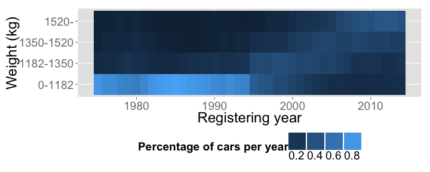
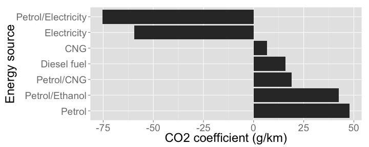

Trafi open data analysis
========================

This document describes the analysis of the Trafi open data. A related blog post can be found here [FIXME ADD]. The analysis uses the [H2O](http://0xdata.com/h2o/) platform and is implemented with [R](http://www.r-project.org/) statistical programming language. This document is created with [knitr](http://yihui.name/knitr/).

We emphasize that the analysis is far from comprehensive and is designed to demonstrate the H2O platform, not to draw conclusions from the data!

The document contains a lot of technical details, so if you wish you can skip straight to the results [here](#visualize-relationships-between-variables) and [here](#quantify-relationships-between-variables).

The car registry data is available from [Trafi](http://www.trafi.fi/tietopalvelut/avoin_data) and is published under the [Trafi open data license](http://www.trafi.fi/tietopalvelut/avoin_data/avoimen_datan_lisenssi). 


## Setting up H2O

Let's first install H2O. This part needs to be run only once.


```r
# The H2O R package in CRAN is not necessarily up to date
# The latest R package is included main H2O package in http://0xdata.com/download/

# You can either download and unzip it manually, or from R with the following to lines
download.file("http://h2o-release.s3.amazonaws.com/h2o/rel-lagrange/11/h2o-2.6.0.11.zip",
              destfile="./h2o/h2o-2.6.0.11.zip")
unzip("./h2o/h2o-2.6.0.11.zip", exdir = "./h2o")

# Install the R package from the source file provided
# Note! You may need to install some dependecies!
install.packages("h2o/h2o-2.6.0.11/R/h2o_2.6.0.11.tar.gz", repos=NULL, type="source")
```

Then load the R packge and start H2O in the background, which takes a bit of time.


```r
# Load library
library("h2o")
# Initialize h2o (by default, this will start H2O) 
H2Olocal <- h2o.init()
```

```
## Successfully connected to http://127.0.0.1:54321 
## R is connected to H2O cluster:
##     H2O cluster uptime:         39 minutes 27 seconds 
##     H2O cluster version:        2.6.0.11 
##     H2O cluster name:           H2O_started_from_R 
##     H2O cluster total nodes:    1 
##     H2O cluster total memory:   0.95 GB 
##     H2O cluster total cores:    4 
##     H2O cluster allowed cores:  4 
##     H2O cluster healthy:        TRUE
```

```r
# Load other necessary packages
library("ggplot2")
library("reshape2")
library("plyr")
theme_set(theme_grey(base_size = 24))
```

## Load data to H2O

The Trafi car registry data is available [here](http://www.trafi.fi/tietopalvelut/avoin_data). The data is given in csv format, which H2O should be able to parse, but there appears to be some problems:

* If a string column contains even one numeric value, the strings will disappear
* Character encoding can not be specified

It seems that these can not be handled by H2O (yet, remember its in early development phase only!), so to include those columns in the data properly, they need to be fixed beforehand.

Here we cheat a little and simply fix those in R. For really big data this would be more tricky, maybe read and fix the data in chunks, or use database and tools such as Hive to deal with it.


```r
# Simply read the data into R and write it again as csv, this time with quotes
temp.trafi <- read.csv("data.csv")
write.csv(temp.trafi, file="data_quoted.csv", quote=TRUE, row.names=FALSE)
```

Then we can import the data into H2O using `h2o.importFile()`. Data can also be loaded using url's or from HDFS.
The data will be imported as an H2OParsedData object. The data could be pulled into R with `as.data.frame()`,
but this is not feasible for big data sets. To demonstrate the H2O tools, we'll keep the data in H2O format for now.


```r
# Import data 
trafi.original.hex <- h2o.importFile(H2Olocal, path="data_quoted.csv", parse=TRUE, header=TRUE, sep=",")

# Let's see what the imported H2OParsedData object looks like
str(trafi.original.hex)
```

Trafi also provides some annotations used in the data in a separate excel file, so let's download and read those too.


```r
download.file(url = "http://www.trafi.fi/filebank/a/1402650899/782fd1d67f9f64628ae4e330c6a88b6a/14931-Koodisto.xlsx",
              destfile = "14931-Koodisto.xlsx")
library("gdata")
trafi.codes <- read.xls("14931-Koodisto.xlsx")
```

## Process data

A few colums are still not parsing right (e.g. mallimerkinta, kaupallinenNimi), but we will forget those for now.
There are in total 33 variables included. For the analysis we'll keep only a subset of them and translate their names to English.


```r
# Choose a subset of the variables and translate to English
trafi.hex <- trafi.original.hex[,c(2,5,6,7,10,11,14,15,16,17,18,19,20,21,22,31)]
names(trafi.hex) <- c("Registering_date", "Starting_date", "Colour", "Door_amount", 
                      "Seat_amount", "Weight", "Length", "Width", 
                      "Height", "Energy_source", "Cylinder_capacity", "Net_power",
                      "Cylinder_amount", "Compressor", "Manufacturer", "CO2")
```

Some of the variables contain numeric codes and the corresponding annotations are given in a separate file.
However, I could not yet figure out how to replace factor values in H2O with new ones, so we will keep the numeric values for now.
In general the hardest part in using H2O instead of R is the limited set of tools available for processing and manipulating data. Thus also the processing phase here is very limited. H2O still contains some useful functions for processing date values, such as `h2o.year()` and `h2o.month()`.


```r
# Change these to factors
trafi.hex$Colour <- as.factor(trafi.hex$Colour)
trafi.hex$Energy_source <- as.factor(trafi.hex$Energy_source)

# Registering date is give in milliseconds
# Convert that to a year with h2o.year()
trafi.hex$Registering_year <- h2o.year(trafi.hex$Registering_date) + 1900

# Start of usage date is given in year month date without separators
# Convert to year simply by diving by 10000 and taking floor
trafi.hex$Starting_year <- floor(trafi.hex$Starting_date/10000)

# Remove original date columms
trafi.hex <- trafi.hex[,-c(1,2)]
```

## Explore and filter data

A very commont step in data analysis is to explore the data and try to detect any anomalies, missing data and outliers.
Visualization is a very handy tool for this, but with big data we can not do that, as it's not possible to plot gazillions
of data points.

A good starting point to explore the data is to use the `summary()` function to get an idea of how the variables are distributed,
how many values are missing, and whether there are some alarming extreme values. Luckily, the `summary()` works for H2O objects also,
so we'll use that here. Indeed there seem to be some very high numerical values, so we'll set some arbitrary thresholds to filter the data. In addition, there are a few missing values (NA's), but we'll let those be for now.


```r
# Summarise the data
summary(trafi.hex)
```

```
##  Colour       Door_amount       Seat_amount      Weight            
##  8   :549187  Min.   :  0.000   Min.   : 1.000   Min.   :       0  
##  2   :476714  1st Qu.:  4.000   1st Qu.: 5.000   1st Qu.:    4675  
##  6   :414795  Median :  4.000   Median : 5.000   Median :    9350  
##  0   :305360  Mean   :  3.983   Mean   : 5.053   Mean   :    1409  
##  9   :212307  3rd Qu.:  4.000   3rd Qu.: 5.000   3rd Qu.:   14025  
##  NA's:215010  Max.   :100.000   Max.   :56.000   Max.   :18911958  
##  Length          Width              Height             Energy_source
##  Min.   :   40   Min.   :      10   Min.   :     117   1   :1961818 
##  1st Qu.: 4248   1st Qu.:    4339   1st Qu.:    3767   2   : 642755 
##  Median : 4481   Median :    8668   Median :    7418   40  :   3105 
##  Mean   : 4455   Mean   :    1761   Mean   :    1514   38  :    899 
##  3rd Qu.: 4678   3rd Qu.:   12996   3rd Qu.:   11068   39  :    276 
##  Max.   :48403   Max.   :18001440   Max.   :14641028   NA's:     56 
##  Cylinder_capacity Net_power           Cylinder_amount    Compressor    
##  Min.   :      2   Min.   :     0.00   Min.   :   1.000   true : 840425 
##  1st Qu.:   1108   1st Qu.:    34.58   1st Qu.:   2.257   false: 355336 
##  Median :   2214   Median :    69.15   Median :   3.514   NA's :1413719 
##  Mean   :   1847   Mean   :    90.83   Mean   :   4.146                 
##  3rd Qu.:   3320   3rd Qu.:   103.73   3rd Qu.:   4.771                 
##  Max.   :4398000   Max.   :125145.00   Max.   :5300.000                 
##  Manufacturer       CO2             Registering_year Starting_year 
##  Toyota    :339399  Min.   :  0.0   Min.   :1975     Min.   :   0  
##  Volkswagen:269044  1st Qu.:145.0   1st Qu.:2000     1st Qu.:1999  
##  Volvo     :205026  Median :165.0   Median :2005     Median :2004  
##  Ford      :194672  Mean   :168.4   Mean   :2004     Mean   :2003  
##  Nissan    :168783  3rd Qu.:187.0   3rd Qu.:2009     3rd Qu.:2008  
##  NA's      :    45  Max.   :630.0   Max.   :2014     Max.   :2014
```

```r
# Change these to factors
# The Min. and Max. value reveal some outliers, let's filter those out
# Note! Cutoffs chosen very arbitrarily now, can be improved later
trafi.clean.hex <- trafi.hex[trafi.hex$Door_amount < 10 & 
                               trafi.hex$Seat_amount < 50 & 
                               trafi.hex$Weight < 100000 & 
                               trafi.hex$Length < 10000 &
                               trafi.hex$Width < 20000 &
                               trafi.hex$Height < 20000 &
                               trafi.hex$Net_power < 1000 &
                               trafi.hex$Cylinder_amount < 10 &
                               trafi.hex$CO2 > 0, ]
```

In our analysis, we are especially interested in the most common energy sources and car manufacturers in the data.
We can identify those using `h2o.table()` and processing the results in R. Then we can take a subset of the original data based on these. A more detailed look at the `Manufacturer` variable reveals that it is very messy, with the same manufacturer name written in multiple ways and thus appearing as different values. A proper cleaning of the data would take a lot of time, so we'll simply keep the most common manufacturer names for this analysis.

Note! In R we have very useful tools for filtering data based on factor values, such as `match()` and `%in%`. However, those are not (yet) available in H2O, so we need a trick to get the subset without repeating a lot of code.


```r
# Take only the most common manufacturers
# Note! There are a lot of messy manufacturer names, which should be cleaned.
man.table <- as.data.frame(h2o.table(trafi.clean.hex$Manufacturer))
man.tokeep <- as.character(man.table$row.names[man.table$Count > 10000])
# Remove Volkswagen VW manually, need to fix this later
man.tokeep <- man.tokeep[man.tokeep!="Volkswagen VW"]

# H2O does not support match or %in%, so we'll need a trick to take a subset based on a group of factor values
subset.expression <- paste("trafi.clean.hex$Manufacturer == man.tokeep[",1:length(man.tokeep),"]",
                           sep="", collapse=" | ")
trafi.clean.hex <- eval(parse(text=paste0("trafi.clean.hex[", subset.expression,",]")))

# Repeat the same for the energy sources (represented by the numerical codes still)
en.table <- as.data.frame(h2o.table(trafi.clean.hex$Energy_source))
en.tokeep <- as.character(en.table$row.names[en.table$Count > 100])
subset.expression <- paste("trafi.clean.hex$Energy_source == en.tokeep[",1:length(en.tokeep),"]",
                            sep="", collapse=" | ")
trafi.clean.hex <- eval(parse(text=paste0("trafi.clean.hex[", subset.expression,",]")))
```

## Visualize relationships between variables

Once we are happy enough with the individual variables, the exploration can turn to studying relationships between variables.
Here again visualizations, especially scatter plots, would be very useful. But even without being able to plot the data,
we can do something still. Here we'll use the `cut()` and `quantile()` functions provided in H2O to group numerical values into groups.
Then we can use `h2o.table()` to create a cross table of two such variables, pull the results to R and visualize them!

As an example, we'll group the `Weight` variable into four groups and then study the proportion of cars in each weight group over the years.


```r
# Study distribution of the Weight variable
quantile(trafi.clean.hex$Weight, na.rm=TRUE)
```

```
##    0%   25%   50%   75%  100% 
##     0  1182  1350  1520 20000
```

```r
# 0%   25%   50%   75%  100% 
#  0  1182  1350  1520 20000 

# Group weight into discrete variables
trafi.clean.hex$Weight.cut <- h2o.cut(trafi.clean.hex$Weight, quantile(trafi.clean.hex$Weight, na.rm=TRUE))

# Now we can use cross tables to compare variables, e.g. weights and years
wy.table <- h2o.table(trafi.clean.hex[c("Registering_year", "Weight.cut")])

# This table we can pull into R for plotting using as.data.frame()
wy.df <- as.data.frame(wy.table)
names(wy.df) <- c("Registering_year", "0-1182", "1182-1350", "1350-1520", "1520-")
# Transform into a more convenient form
wy.df <- reshape2::melt(wy.df, id.var="Registering_year")
names(wy.df)[2] <- "Weight_group"
# Compute proportion of different Weight groups per year
wy.df <- plyr::ddply(wy.df, "Registering_year", transform, Proportion=value/sum(value))
# Plot
ggplot(wy.df, aes(x=Registering_year, y=Weight_group)) + geom_tile(aes(fill=Proportion)) + 
  theme(legend.position="bottom") + labs(fill="Percentage of cars per year") + 
  guides(fill=guide_legend(label.position="bottom", keywidth=2, keyheight=2))
```

 

The figure shows the four weight groups on the y-axis and the years from 1975 to 2014 in the x-axis. The coloured tiles show the percentage of cars in each weight group for each year. The figure reveals a pretty clear trend where most of the cars are very small until around 1995, when the distribution starts to gradually shift towards larger cars.

## Quantify relationships between variables

Next we want to do some proper quantitative analysis on the data. Specifically, we are interested in
how the other variables, such as energy source and manufacturer, affect the CO2 emissions of the cars. Here linear regression is very good first tool,
as it gives nicely interpretable results. H2O provides the `h2o.glm()` function which can be used for linear regression.


```r
# Center numerical variables to start from zero
trafi.clean.hex$Year_n <- trafi.clean.hex$Registering_year - mean(trafi.clean.hex$Registering_year, na.rm=TRUE)
trafi.clean.hex$Weight_n <- trafi.clean.hex$Weight - mean(trafi.clean.hex$Weight, na.rm=TRUE)
# Run linear regression
trafi.glm <- h2o.glm(y="CO2", x=c("Year_n", "Weight_n", "Energy_source", "Compressor", "Manufacturer"),
                     data=trafi.clean.hex, family="gaussian", alpha=0.5, variable_importances=TRUE, 
                     use_all_factor_levels=TRUE, standardize=FALSE)

# Separate coefficients for manufactures, energy sources, and other factors
coefs <- trafi.glm@model$coefficients
coefs.manufactures <- sort(coefs[grep("Manufacturer", names(coefs))], decreasing = TRUE)
coefs.energysource <- sort(coefs[grep("Energy_source", names(coefs))], decreasing = TRUE)
coefs.other <- coefs[!(names(coefs) %in% c(names(coefs.manufactures), names(coefs.energysource)))]
names(coefs.manufactures) <- gsub("Manufacturer.", "", names(coefs.manufactures))

# Translate energy source codes appearing in the model to understandable ones
# Note! This is not needed when we figure out how to fix the levels already in H2O
energysource.codes <- droplevels(subset(trafi.codes, KOODISTONKUVAUS=="Polttoaine" & KIELI=="en"))
energysource.codes$KOODINTUNNUS <- as.numeric(as.character(energysource.codes$KOODINTUNNUS))
es.codes.num <- as.numeric(gsub("Energy_source.", "", names(coefs.energysource)))
names(coefs.energysource) <- as.character(energysource.codes$LYHYTSELITE[match(es.codes.num, energysource.codes$KOODINTUNNUS)])
```

Now we can study the coefficients produced by the regression model. They tell us how each supplied factor affects the CO2 levels. Let's first plot the coeffcients for the different force types. 


```r
# Plot the  the effect of force types
en.df <- data.frame(Energy_source=factor(names(coefs.energysource), levels=names(coefs.energysource)),
                    Coefficient=coefs.energysource)
ggplot(en.df, aes(x=Energy_source, y=Coefficient)) + geom_bar(stat="identity") +
  coord_flip() + ylab("CO2 coefficient (g/km)")
```

 

Based on the plot it's very clear that electric and hybrid (Petrol/Electricity) cars emit the least amount of CO2, which was expected. Also CNG (compressed natural gas) and diesel cars omit less than traditional petrol fuel cars. Note that there are only some hundreds of hybrids or eletric cars in the data set, so the actual values are not very reliable. But as those become more popular, also the data becomes more accurate.

Next we'll plot similarly the coeffecients for each car manufacturer. 


```r
# Plot the  the effect of force types
man.df <- data.frame(Manufacturer=factor(names(coefs.manufactures), levels=names(coefs.manufactures)),
                     Coefficient=coefs.manufactures)
ggplot(man.df, aes(x=Manufacturer, y=Coefficient)) + geom_bar(stat="identity") +
  coord_flip() + ylab("CO2 coefficient (g/km)")
```

 

The first thing to note is that effect sizes for the manufacturers are much smaller than those seen for the energy sources. So even though this allows the ranking of cars based on emissions, the differences are not large in practice. 

Let's also check the remaining factors that were included in the regression.


```r
coefs.other
```

```
## Compressor.false  Compressor.true           Year_n         Weight_n 
##           3.2465          -3.2465          -4.6118           0.1162 
##        Intercept 
##         140.8865
```

Having a compressor has a very small reducing effect on the CO2 emissions. The emissions increase on average for about 5 g/km per added year and for about 1 g/km per 10 kilograms of added car weight. The `Intercept` is the baseline of the CO2 level, and is indeed close to the average CO2 value over the data.


## Shut down H2O

Note that quitting R now would not necessarily shut down the H2O running on the background,
so it's good to explicitly shut it down.


```r
h2o.shutdown(H2Olocal)
```

## Session info


```r
sessionInfo()
```

```
## R version 3.1.1 (2014-07-10)
## Platform: x86_64-apple-darwin13.1.0 (64-bit)
## 
## locale:
## [1] en_US.UTF-8/en_US.UTF-8/en_US.UTF-8/C/en_US.UTF-8/en_US.UTF-8
## 
## attached base packages:
## [1] tools     stats     graphics  grDevices utils     datasets  methods  
## [8] base     
## 
## other attached packages:
##  [1] gdata_2.13.3   plyr_1.8.1     reshape2_1.4   ggplot2_1.0.0 
##  [5] h2o_2.6.0.11   statmod_1.4.20 rjson_0.2.14   RCurl_1.95-4.3
##  [9] bitops_1.0-6   knitr_1.6     
## 
## loaded via a namespace (and not attached):
##  [1] colorspace_1.2-4 digest_0.6.4     evaluate_0.5.5   formatR_0.10    
##  [5] grid_3.1.1       gtable_0.1.2     gtools_3.4.1     labeling_0.2    
##  [9] markdown_0.7.2   MASS_7.3-33      munsell_0.4.2    proto_0.3-10    
## [13] Rcpp_0.11.2      scales_0.2.4     stringr_0.6.2
```

